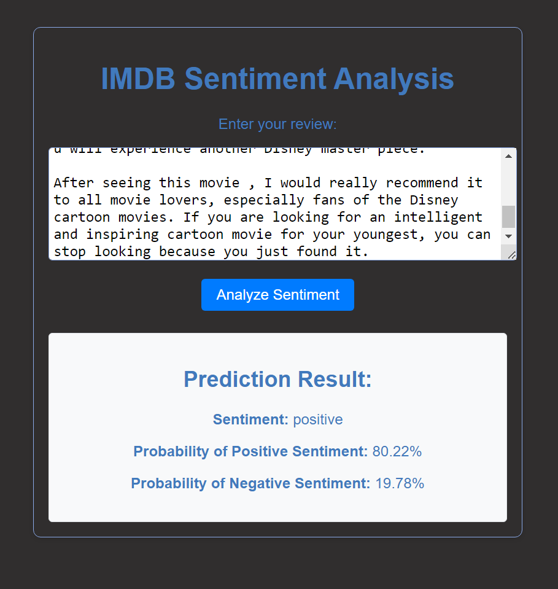
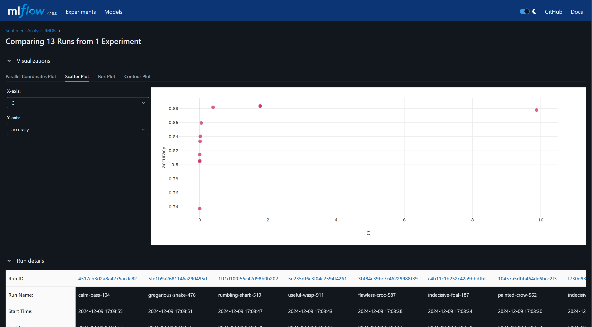
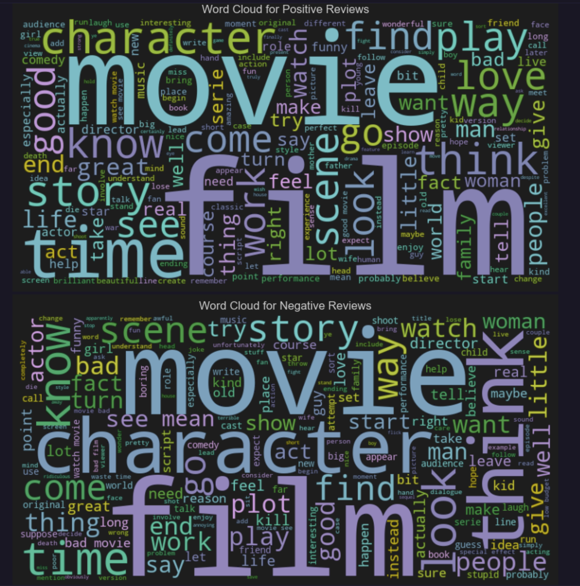
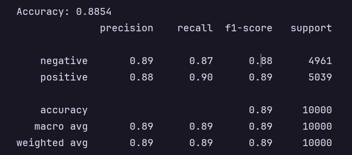

# 🎬 IMDBML: Movie Review Classification with Machine Learning


---

## 👥 Contributors

- [ Meunier A.](https://github.com/Meunier6969)
- [ Corentin_k_](https://github.com/Corentin-k)
- [ Toiteski](https://github.com/toiteski)
- [ Mailinh](https://github.com/MailinhTA)
- [ Lolo2109](https://github.com/lolo2109)

---

## 📖 Description

**IMDBML** is a machine learning project focused on analyzing and classifying movie reviews from IMDb into **positive** or **negative** sentiments.
The project is centered around building a robust sentiment analysis model using Logistic Regression and Natural Language Processing techniques.

We have built a web application that allows users to submit a movie review and receive a response indicating whether the review is positive or neutral.

Key Components

- Machine Learning Model: The model is built using a Logistic Regression classifier, trained on a cleaned and preprocessed dataset of IMDb movie reviews.
- Data Preprocessing: Natural Language Processing (NLP) techniques, such as tokenization, lemmatization, and stop word removal, are applied to the reviews before training the model.
- Model Evaluation: The model is evaluated on metrics like accuracy, precision, recall, F1 score, and AUC-ROC to ensure high performance.

Web Interface (Vue.js + Docker)
The web application interface allows users to input movie reviews and get predictions based on the trained machine learning model. It was developed using Vue.js and Docker to create a seamless deployment and containerized environment for the application.

## ✨ Features

- Sentiment Classification: Users can submit a movie review, and the model will classify it as either positive or neutral.
- Model Insights: Displays key performance metrics like accuracy, F1 score, and confusion matrix.
- Word Cloud Visualization: View visualizations of the most frequent words used in positive and negative reviews.

## Technologies

- Python: For the backend, where the machine learning model is built and trained.
- FastAPI: A lightweight framework for serving the backend API for sentiment analysis.
- Vue.js: For the frontend to create an interactive web interface.
- Docker: Used for containerizing both the frontend and backend, ensuring easy deployment.
- Scikit-learn: For machine learning tasks such as text vectorization (TF-IDF) and logistic regression.
- SpaCy: For data preprocessing, including tokenization, lemmatization, and stop-word removal.
- WordCloud: For generating word cloud visualizations of frequent words in reviews.
- MlFlow: For tracking and logging model training metrics and parameters.

## Prerequisites

Before you begin, make sure you have the following tools installed on your machine:

- **Node.js** (for the Vue.js frontend)
- **Python 3.x** (for the backend)
- **Docker** (for containerization)
- **npm** (for managing frontend dependencies)

## 🚀 Installation

### 1. Clone the Repository

Clone this repository to your local machine:

```bash
git clone https://github.com/your-username/imdbml.git
cd imdbml
```

### 2. Install Frontend Dependencies

Navigate to the `frontend` directory and install the required dependencies:

```bash
cd frontend
npm install
```

### 3. Install Backend Dependencies

Navigate to the `backend` directory and create a virtual environment:

```bash
cd backend
python3 -m venv venv
source venv/bin/activate
pip install -r requirements.txt
```

### 4. Run the Application

1. Start the FastAPI backend:

```bash
uvicorn main:app --reload
```
The backend will be available at http://localhost:8000, and the API will be ready to receive requests.

2. Start the Vue.js frontend:

```bash
cd frontend
npm run serve
```

This will run the frontend on http://localhost:8080, where you can interact with the application.

## Docker

```bash
docker-compose up --build
```

---
## 📊 Model Evaluation

The sentiment analysis model has been evaluated on several metrics:

- **Accuracy**: 88.54%
- **Precision**:
  - Positive: 0.88
  - Negative: 0.89
- **Recall**:
  - Positive: 0.90
  - Negative: 0.87
- **F1-Score**:
  - Positive: 0.89
  - Negative: 0.88
- **AUC**: 0.95

These results indicate that the model performs well at classifying movie reviews into positive and negative sentiments.

---

## 📷 Screenshots








